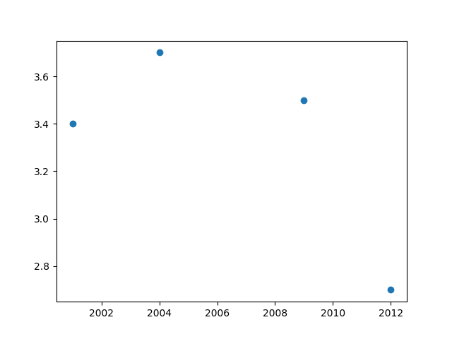

# Naim's Portfolio

# [📊Data Analysis with Python](https://github.com/rahmannaimur/datazone.git)

**Getting started with data analysis** 
I'm building my foundations in data analysis — learning how to ask the right questions, explore datasets, and turn numbers into insights. This space is where I document that journey, mistakes and all.

# What I'm currently learning
* Data cleaning and exploratory data analysis (EDA)
* Python with pandas and numpy
* Data visualization with matplotlib and seaborn
* SQL for querying and aggregating data
* What you'll find in this portfolio
* Small projects and analyses on real-world datasets
* Notebooks that walk through my thinking step by step
* Experiments as I pick up new tools and techniques

